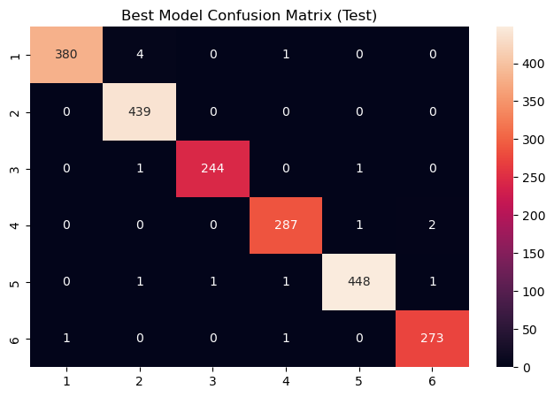
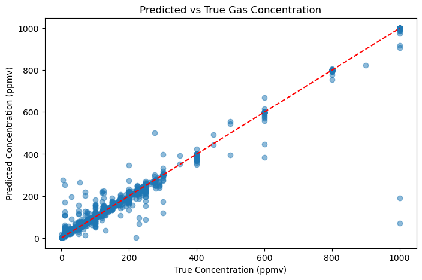

# Gas Sensor Analytics: Classification & Regression with UCI Drift Dataset

This project demonstrates **machine learning on chemical sensor data** for two tasks:

1. **Gas Classification (Phase 1):** Identify which of 6 gases is present.
2. **Gas Concentration Regression (Phase 2):** Predict concentration level (ppmv).

The dataset is the **Gas Sensor Array Drift Dataset at Different Concentrations** from the 
[UCI Machine Learning Repository](https://archive.ics.uci.edu/ml/datasets/Gas+Sensor+Array+Drift+Dataset+at+Different+Concentrations).

---

## Dataset Description

- Collected from **16 chemical sensors** (UCSD BioCircuits Institute, 2007–2011).
- Each measurement is represented by **128 engineered features**:
  - **Steady state features** (ΔR, normalized ΔR).
  - **Transient features** from exponential moving averages (EMA) at α = 0.001, 0.01, 0.1 for rise and decay.
- Total: **13,910 measurements**, split into **10 batches** (simulating sensor drift).
- Gases:  
  1 = Ethanol  
  2 = Ethylene  
  3 = Ammonia  
  4 = Acetaldehyde  
  5 = Acetone  
  6 = Toluene  
- Concentration range: **5–1000 ppmv**

---

## Phase 1: Gas Classification

**Goal:** Identify which gas is present given 128 features.

### Models Tested
- Logistic Regression
- Support Vector Machine (RBF kernel)
- Random Forest

### Results
- All models achieved ~**99% accuracy**.
- **Random Forest** performed best, with macro F1 = 0.99.
- Minimal confusion between classes.



---

## Phase 2: Concentration Regression

**Goal:** Predict the gas concentration level (ppmv).

### Models Tested
- Linear Regression
- Support Vector Regressor (RBF kernel)
- Random Forest Regressor

### Results
- **Random Forest Regressor** performed best:
  - **MAE ≈ 5–10 ppmv**
  - **RMSE ≈ 20 ppmv**
  - **R² ≈ 0.95–0.98**
- Model predictions align closely with true concentration values.

  <!-- optional -->

---

## How to Use

1. Clone this repository:
   ```bash
   git clone https://github.com/YOUR_USERNAME/gas-sensor-analytics.git
   cd gas-sensor-analytics
